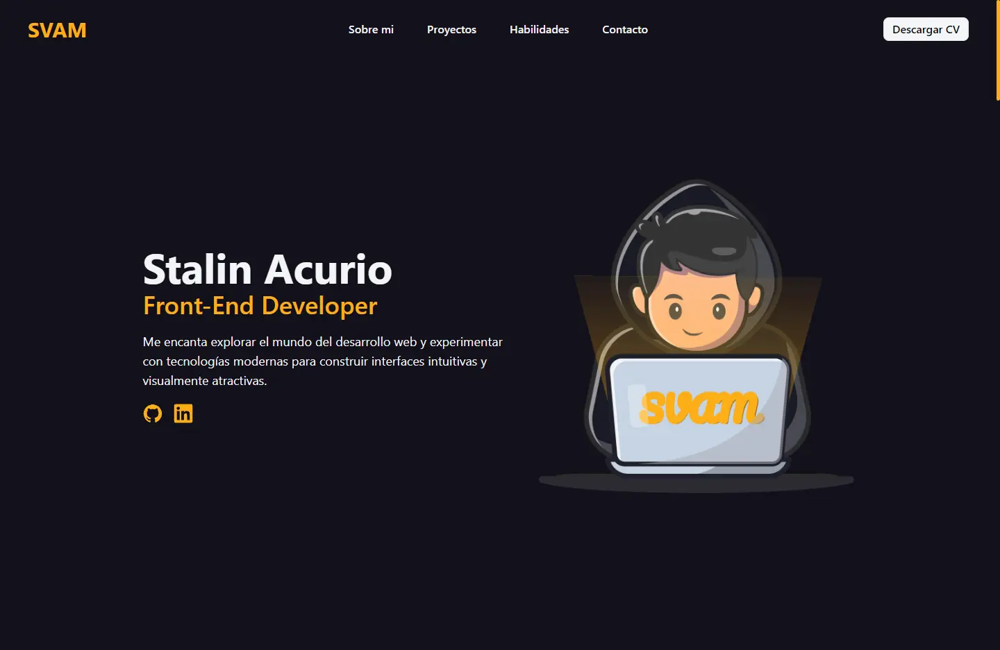

# Portafolio - Challenge ONE Front-end Sprint

El objetivo de este reto es crear un portafolio donde pueda mostrar mis proyectos, experiencia y contar un poco sobre quién soy. Así, ejercitar aún más mis conocimientos de HTML, CSS y Javascript.

## Table of contents

- [Portafolio - Challenge ONE Front-end Sprint](#portafolio---challenge-one-front-end-sprint)
  - [Table of contents](#table-of-contents)
  - [Resumen](#resumen)
    - [Requisitos del desafío](#requisitos-del-desafío)
    - [Enlaces](#enlaces)
    - [Construido con:](#construido-con)
  - [Author](#author)

## Resumen

### Requisitos del desafío

Debe tener un menú de navegación.
Debe tener una imagen que se utilizará como banner.
Debe contener una sección sobre mí.

Debe tener una foto de perfil.
Debe incluir enlaces a sus redes sociales.
Debe tener sus datos personales:

 - Nombre
 - Edad
 - Nacionalidad
 - Biografía
Debe tener una sección de Hobbies y Soft Skills
Por ejemplo:
Pasatiempos: actividades que disfruta hacer.
Habilidades blandas: comunicación, liderazgo, empatía …

Debe tener una sección de formación y cursos.
Aquí puedes poner las formaciones y cursos que has realizado, aunque no esté en el área de programación.
Debe tener experiencia en la sección de programación.
Aquí puedes poner los proyectos que ya has realizado anteriormente, como por ejemplo: los proyectos del retador principiante en programación.
Debe tener un formulario de contacto con los siguientes campos
   -  Correo electrónico
   - Nombre
   - Asunto
   -  Mensaje
Debe tener un Pie de página con la información de la persona que desarrolló el portafolio.
Es de extrema importancia que el portafolio sea responsivo, lo que quiere decir que debe adaptarse a los diferentes tamaños de pantallas, pudiendo ser desktop, tablet o celular.
Importante: Todas las imagenes estaran disponible en el Figma para hacer descarga.

Extras:
- La página debe contener un botón que le permita ver, en una nueva pestaña, una versión PDF de su currículum.

### Enlaces

- Solución URL: [Github](https://github.com/StalinAM/alura-portfolio.git)
- Sitio en línea URL: [SVAM Potafolio](https://svam-alura.netlify.app/)

### Construido con:

- Semantic HTML5 markup
- CSS custom properties
- Flexbox
- JavaScript
- [Astro](https://astro.build/)
- [Tailwind](https://tailwindcss.com/)
- [Netlify](https://www.netlify.com/)

## Author

- GitHub - [StalinAM](https://github.com/StalinAM)
- ONE – Oracle Next Education - [Oracle](https://www.oracle.com/lad/education/oracle-next-education/)
- Alura LATAM - [Alura](https://www.aluracursos.com/)
